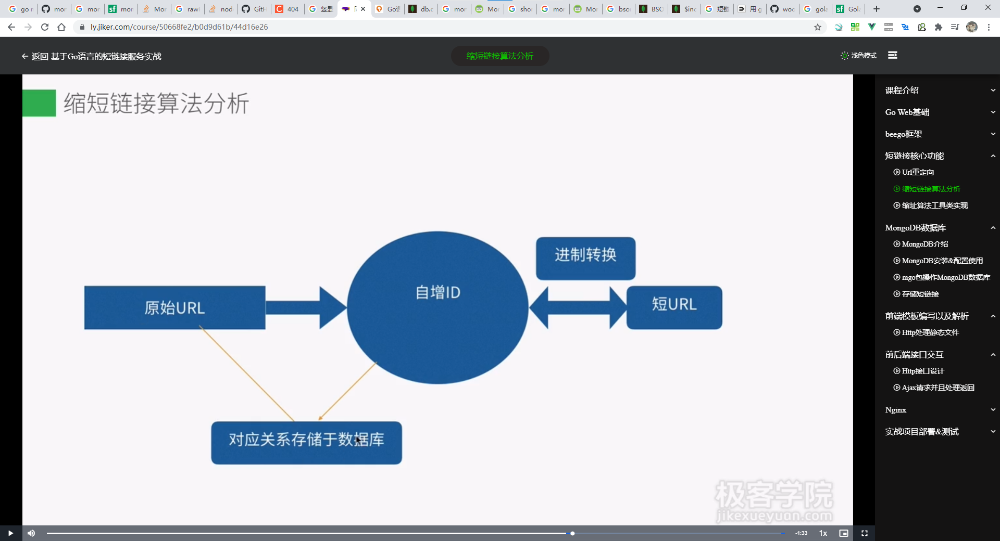

# warning
当前项目还未完工

### 短链核心流程

#### step1
输入一个长连接返回一个短链，短链后缀是一个62进制的自增主键，mongodb中保存一份kv数据
#### step2
输入短链，通过截取path,转换成id，到mongodb中寻找长链，并通过http status  302 加上redirect location 来临时重定向到长链中


### 实现接口
在 `lib\mux\mux_handler.go` 中实现了 `net/http`中的`ServeHTTP`
设置了构造参数，初始化两个map
设置方法，来动态添加成员变量


最后实现`ServeHTTP`方法来 作为路由的核心逻辑


### mongodb实现类型redis中的自增键
#### TODO
mongodb在获取incrNum会出现并发问题，incr和get并不是原子操作，后续更新为redis


初始化collection
```
db.gen_id_col
```
插入数据
```
one, err := collection.InsertOne(ctx, bson.D{{"_id","url"},{"maxId",0}})
```
通过每次更新incr + 1
```
collection.UpdateOne(ctx, bson.D{{"_id", "url"}}, bson.D{{"$inc", bson.D{{"maxId", 1}}}})
```
